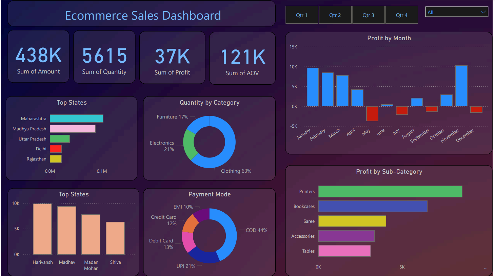

# E-commerce Sales Data Analysis and Dashboard


## 📌 Project Overview

This project focuses on analyzing e-commerce sales data and building an interactive dashboard to understand sales performance, profitability, customer purchasing patterns, product categories, and payment preferences.

The project combines **SQL, Microsoft Excel, and Power BI** to perform data analysis and present business insights through an interactive dashboard.

---

## 🎯 Objectives

The key objectives of this project are to:

* Analyze overall sales, profit, and quantity performance.
* Identify monthly profit trends.
* Compare sales performance across different states.
* Analyze product categories and sub-categories.
* Identify top-performing customers.
* Understand customer payment preferences.
* Create an interactive dashboard for business decision-making.

---

## 🛠️ Tools & Technologies

* **SQL / MySQL** – Data querying and analysis
* **Microsoft Excel** – Data preparation and exploration
* **Microsoft Power BI** – Data visualization and dashboard development

---

## 📂 Dataset

The project uses two datasets:

### 1. Orders Dataset

Contains order and customer-related information:

* Order ID
* Order Date
* Customer Name
* State
* City

### 2. Details Dataset

Contains transaction and product-related information:

* Order ID
* Amount
* Profit
* Quantity
* Category
* Sub-Category
* Payment Mode

The datasets are connected using the **Order ID** field.

---

## 🔍 SQL Analysis

SQL was used to analyze the e-commerce data and answer key business questions.

The analysis includes:

### Total Revenue

Calculated the overall revenue generated from all orders.

```sql
SELECT SUM(amount) AS total_revenue
FROM order_details;
```

### Monthly Revenue Analysis

Analyzed revenue trends across different months.

### Category-wise Revenue

Compared revenue generated by different product categories.

### State-wise Sales Performance

Analyzed sales performance across different states and ranked them based on revenue.

The SQL analysis uses:

* `SELECT`
* `SUM()`
* `GROUP BY`
* `ORDER BY`
* `JOIN`

---

## 📊 Power BI Dashboard

An interactive dashboard was created in Power BI to visualize key business metrics and trends.

### Key KPIs

* **Total Sales Amount:** ₹438K
* **Total Quantity:** 5,615
* **Total Profit:** ₹37K
* **Average Order Value:** ₹121K

### Dashboard Analysis

The dashboard includes:

* Profit by Month
* Sales Performance by State
* Quantity by Category
* Top Customers
* Payment Mode Distribution
* Profit by Sub-Category

Interactive filters allow users to explore data based on different quarters and other selections.

---

## 📈 Key Insights

* **Clothing** contributes the largest share of quantity sold, followed by Electronics and Furniture.
* **COD (Cash on Delivery)** is the most commonly used payment mode.
* **Printers** are among the most profitable sub-categories.
* Sales performance varies significantly across different states, with Maharashtra being one of the leading states.
* Profit changes across months, with some months generating negative profit, highlighting areas for further investigation.
* The dashboard helps identify high-performing categories, customers, states, and products.

---

## 🖥️ Dashboard Preview




---

## 📁 Project Structure

```text
Ecommerce-Sales-Dashboard/
│
├── Details.csv
├── Orders.csv
├── Ecommerce_sales_analysis.sql
├── Ecommerce sales Dashboard.pbix
├── Dashboard.png
└── README.md
```

---

## 🚀 How to Use

1. Clone this repository:

```bash
git clone https://github.com/kunal7042/Ecommerce-Sales-Dashboard.git
```

2. Open the SQL file in your preferred SQL environment.

3. Import the datasets:

   * `Orders.csv`
   * `Details.csv`

4. Run the SQL queries available in:

```text
Ecommerce_sales_analysis.sql
```

5. Open the Power BI file:

```text
Ecommerce sales Dashboard.pbix
```

6. Explore the dashboard using the available filters and visuals.

---

## 💡 Skills Demonstrated

* Data Analysis
* SQL Querying
* Data Aggregation
* Data Joining
* Data Preparation
* Microsoft Excel
* Power BI
* Dashboard Development
* Data Visualization
* Business Insight Generation

